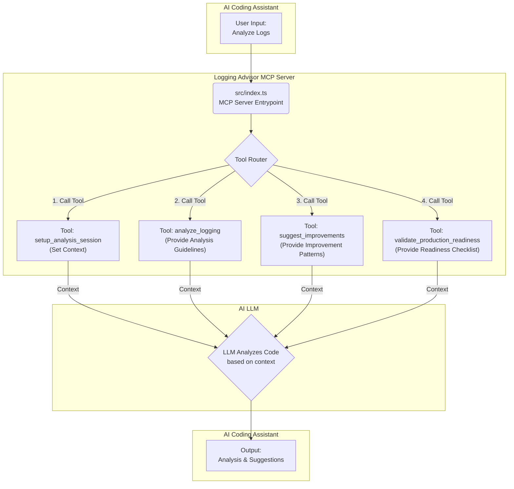

# 손쉽게 로깅 관리하기: Logging Advisor MCP 서버 개발기

안녕하세요. Logging Advisor MCP를 개발한 g-hyeong 입니다.

"이 로그, 지금 제대로 남기고 있는 게 맞나?"

빠른 개발과 잦은 배포 환경에서 개발자라면 한 번쯤 해봤을 고민입니다.

'누군가 옆에서 로깅에 대한 전문가적인 조언을 해주면 좋겠다'는 생각에서 이 프로젝트를 시작했습니다. 이 글은 로깅 관리의 어려움을 해결하기 위해 AI와 MCP를 활용해 **Logging Advisor MCP 서버**를 개발한 과정을 담고 있습니다.

### 요약

*   **Logging Advisor MCP 서버**: AI 코딩 도구가 로깅 품질을 분석하고 개선안을 제시하는 데 필요한 전문 컨텍스트를 제공합니다.
*   **워크플로우**: **세션 설정 → 분석 → 개선 → 검증**의 체계적인 워크플로우를 통해 로깅 품질 개선을 유도합니다.
*   **기술 스택**: TypeScript와 Zod를 중심으로 구현하여 확장성과 유지보수성을 확보했습니다.
*   **목표**: 이 글이 로깅 시스템 개선이나 MCP 활용에 관심 있는 분들께 도움이 되기를 바랍니다.

## 구현 배경: "로그, 어떻게 남겨야 잘 남기는 걸까?"

신입 개발자로 MSA 환경에서 개별 서버를 전담하며 개발했습니다. 저희 회사는 빠른 개발, 잦은 배포를 추구했고, 각 개발자가 서버의 완전한 오너십을 갖는 문화였습니다. 그 결과 로깅이나 예외 처리에 대한 전사적인 컨벤션이 없었습니다.

처음에는 자유롭다고 생각했지만, 프로젝트 규모가 커지면서 문제에 부딪혔습니다.
*   **판단의 어려움**: 가이드가 없어 모든 로깅을 개인적인 판단에 의존해야 했습니다.
*   **과부하 우려**: 로그가 과도하게 쌓여 시스템 성능과 비용에 영향을 줄까 항상 걱정했습니다.
*   **장애 추적의 한계**: 장애 발생 시, 남겨진 로그만으로는 원인 추적이 어려운 경우가 있었습니다.

1년차 개발자로서 빠르게 진행되는 개발 속도 속에서 모든 로깅을 세심하게 신경 쓰기란 현실적으로 부담이 컸습니다. 로깅에 대한 전문 지식도 없었고, 주변 동료들도 모두 주니어라 조언을 구하기 마땅치 않은 상황이었습니다.

"누군가 로깅에 대해 전문가처럼 조언해줄 수 있다면."

이 고민을 해결하기 위해 평소 관심이 많았던 LLM과 MCP를 활용하기로 했습니다. AI에게 '로깅 전문가'의 역할을 맡겨 개발에 더 집중할 수 있는 환경을 만들고 싶었고, 그렇게 **Logging Advisor MCP 서버**를 개발하게 되었습니다.

## MCP란?

MCP(Model-Context Protocol)는 LLM이 특정 도메인의 맥락을 이해하고 활용하도록 돕는 표준 프로토콜입니다. MCP 서버를 구현하면, Cursor, Claude 등 MCP를 지원하는 여러 AI 클라이언트에서 일관된 방식으로 AI에게 추가적인 능력을 부여할 수 있습니다.

저는 MCP를 활용하여 AI 모델에게 '로깅 전문가'의 지식을 제공하고, 개발자가 로깅 품질을 체계적으로 관리할 수 있는 환경을 만들고자 했습니다.

## Logging Advisor MCP 서버 아키텍처

서버의 목표는 개발자가 로깅 품질을 점진적으로 개선하도록 체계적인 워크플로우를 제공하는 것입니다. 이를 위해 핵심 기능을 4개의 '도구(Tool)'로 분리하고, 각 도구가 명확한 책임을 갖도록 구성했습니다.

<div align="center">


**그림 1: Logging Advisor MCP 서버 아키텍처 및 워크플로우**
</div>

### 기술 스택

*   **TypeScript**: 정적 타입으로 코드 안정성 확보
*   **Node.js**: 서버 런타임
*   **@modelcontextprotocol/sdk**: MCP 서버 구현을 위한 공식 SDK
*   **Zod**: 스키마 정의 및 유효성 검사

### 프로젝트 구조

```
/src
|-- /schemas
|   `-- types.ts         # Zod 스키마 정의
|-- /tools
|   |-- /analyze_logging
|   |-- /setup_analysis_session
|   |-- /suggest_improvements
|   |-- /validate_production_readiness
|   `-- index.ts         # 도구 통합 export
`-- index.ts             # MCP 서버 진입점
```

`src/index.ts`는 MCP 서버를 초기화하고 요청을 각 도구의 핸들러로 라우팅합니다. 핵심 로직은 `src/tools` 디렉토리에 기능별로 모듈화하여 유지보수가 용이하도록 구성했습니다.

## 핵심 도구(Tool) 워크플로우

Logging Advisor는 **"세션 설정 → 분석 → 개선 → 검증"** 의 워크플로우로 사용자를 안내합니다. 각 단계는 MCP 서버의 특정 'tool'을 호출하여 수행됩니다.

### 1단계: `setup_analysis_session` - 분석 환경 설정

분석의 시작점입니다. **대상 환경, 서비스 중요도** 등의 정보를 받아 분석 세션을 초기화하고, 전체 워크플로우를 안내합니다.

### 2단계: `analyze_logging` - 로깅 품질 분석 가이드라인 제공

세션 설정 후, 이 도구를 통해 로깅 품질 분석에 필요한 **가이드라인**을 AI에게 제공합니다. 서버가 직접 코드를 분석하는 대신, AI에게 분석 기준을 알려주는 방식입니다.

### 3단계: `suggest_improvements` - 구체적인 개선안 제시

분석된 문제점을 해결하기 위한 **코드 수준의 개선안과 마이그레이션 전략**을 제안합니다.

### 4단계: `validate_production_readiness` - 배포 준비 상태 검증

개선 작업 완료 후, 코드를 프로덕션에 배포해도 안전한지 최종 검증하는 **필수 체크리스트**를 제공합니다.

## 구현 과정에서의 주요 결정

### 1. Zod를 활용한 스키마 중심 개발

AI 모델과의 명확한 데이터 통신을 위해 Zod를 사용했습니다. Zod 스키마로 TypeScript 타입 추론과 AI가 이해하는 JSON Schema 생성을 동시에 해결하여 개발 안정성을 높였습니다.

### 2. '가이드라인' 제공 방식 선택의 이유

초기에 서버가 직접 코드를 분석하거나 AI와 전체 코드를 주고받는 방식을 고려했지만, 확장성과 효율성 문제로 현재의 '가이드라인 제공' 방식을 선택했습니다.

*   **서버 직접 분석**: 새 언어/프레임워크 지원 시 서버 수정 비용이 큼
*   **코드베이스 통신**: LLM 토큰 사용량과 응답 시간 증가로 비효율적

결론적으로 서버의 역할을 **"로깅 분석을 위한 전문 컨텍스트 제공"** 에 집중시켰습니다. 이 방식은 서버의 복잡도는 낮추고 AI의 분석 능력은 극대화하여 효율성과 확장성을 모두 확보하는 최적의 선택이었습니다.

### 3. 워크플로우 기반의 모듈식 도구 설계

로깅 개선은 점진적인 과정이므로, `setup` → `analyze` → `suggest` → `validate`의 워크플로우를 설계하고 각 단계를 별도 'tool'로 모듈화했습니다. 이는 단일 책임 원칙을 지키고, 유지보수와 기능 확장을 용이하게 만들었습니다.

## 사용 예시

Logging Advisor는 사용자의 코드를 직접 받지 않습니다. 대신 AI 코딩 도우미에게 '전문 지식'을 컨텍스트로 제공하여 코드 분석을 돕습니다.

1.  **(User)**: `@logging-advisor analyze_logging`으로 가이드라인 요청
2.  **(AI)**: MCP 서버로부터 받은 로깅 전문가 가이드라인을 컨텍스트에 추가
3.  **(User)**: "이 가이드라인을 바탕으로 내 코드의 로깅 품질을 분석해줘."
4.  **(AI)**: 전문가 컨텍스트를 활용하여 코드 분석 후 답변 생성

## 마치며

Logging Advisor MCP 서버를 개발하며 AI 코딩 도구를 '전문 컨설턴트'로 활용할 가능성을 보았습니다. 잘 정제된 도메인 지식을 MCP를 통해 제공했을 때 AI의 성능은 기대 이상이었습니다.

### 오픈소스로서의 가치

이 프로젝트는 오픈소스입니다. 각 팀은 `handler.ts` 파일을 수정하여 자신들의 로깅 라이브러리나 컨벤션에 맞는 가이드라인을 설정할 수 있습니다. 이렇게 AI가 우리 팀의 규칙에 맞는 조언을 제공하도록 만들 수 있습니다.

현재는 AI 어시스턴트에게 가이드라인을 제공하는 데 집중하고 있지만, 향후 이 기능을 수행하는 '로깅 점검 에이전트'를 개발하는 것도 검토 중입니다. 현재 Multi-Agent 기반 개발 플랫폼 프로젝트를 구상 중이기 때문에, 반영된다면 그 안에서 하나의 Agent로서 동작할 것입니다.


---

**[Github 저장소 바로가기](https://github.com/g-hyeong/logging-advisor-mcp)**
